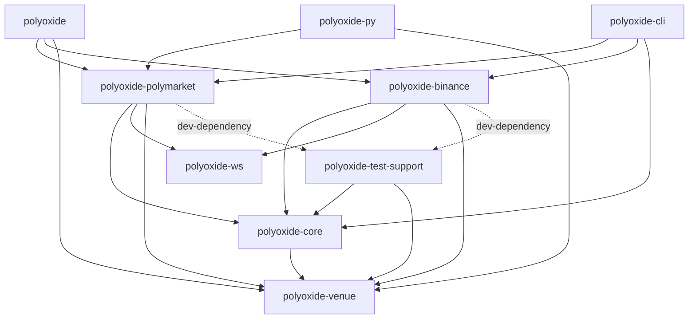
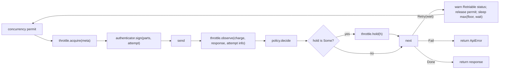
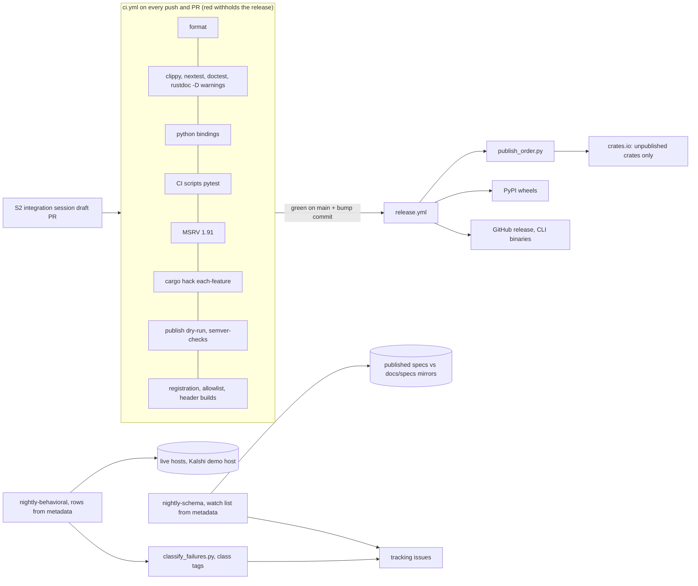

# Architecture Spine — polyoxide venue extensibility

## Design Paradigm

**Layered kernels with ports-and-adapters at the venue seam.**
- `polyoxide-venue` holds the ports: vocabulary, identity, classification and traits.
- Two kernels sit above it: `polyoxide-core` (HTTP) and `polyoxide-ws` (sockets).
- Each venue crate is an adapter. It plugs venue policy into the kernels through hooks and implements the ports.
- Facades compose venues and hold no venue logic.

| Layer | Crates | Holds |
| --- | --- | --- |
| Facades | `polyoxide`, `polyoxide-cli`, `polyoxide-py` | Re-exports, the command tree, bindings |
| Venue adapters | `polyoxide-polymarket`, `polyoxide-binance`, later `polyoxide-kalshi` | Native clients per module; hook, `Protocol` and trait implementations |
| Kernels | `polyoxide-core`, `polyoxide-ws` | Core: the send loop, throttle seam, window-quota table, capacity bucket, hold and keychain. Ws: the socket kit, `Supervisor` and scripted server |
| Ports | `polyoxide-venue` | Keys, `Class`, records, `Extensions`, traits, `Secret`, `UnixMillis`, wire-enum and socket-classification macros |
| Dev-only | `polyoxide-test-support` | Agreement helpers, fixture loading, the soak harness, the failure-tag reporter |

## Invariants & Rules



### AD-1 — Crate layers and dependency direction [ADOPTED]

- **Binds:** all
- **Prevents:** a venue reaching into another venue; kernels depending on venues; test helpers at runtime; two copies of a crate in one test build.
- **Rule:**
  - A venue crate's edges are `polyoxide-core`, `polyoxide-ws` and `polyoxide-venue`, and nothing in-workspace beyond them.
  - `polyoxide-core` depends on `polyoxide-venue`. `polyoxide-ws` depends on neither.
  - Facades may depend on venue crates, `polyoxide-core` and `polyoxide-venue`.
  - `polyoxide-test-support` is `publish = false`. It depends on `polyoxide-core` and `polyoxide-venue`, never on a venue crate, and venue crates take it only as a path-only dev-dependency.
  - A helper that inline unit tests need stays in the crate under test, or in `polyoxide-ws`'s `test-server`.
  - Anything published behind `test-server` is built only from published crates.

### AD-2 — Credential-free dependency fence [ADOPTED]

- **Binds:** CAP-3, `polyoxide-ws`, every credential-free module
- **Prevents:** a credential-free feed building HTTP or signing stacks through feature unification.
- **Rule:**
  - `polyoxide-ws` depends only on tokio, tokio-tungstenite, futures-util, thiserror, tracing, rustls (`ring`, `std`), and optionally serde and serde_json.
  - In venue crates, `polyoxide-core`, `alloy` and every `src/shared/` item are gated by the features that use them.
  - CI diffs `cargo tree -e normal` for each module against a committed per-module allowlist.
  - Global deny-lists:
    - socket-only modules: `reqwest`, `alloy*`, `polyoxide-core`, `governor`, `hmac`, `sha2`, `keyring`;
    - every credential-free feature: `alloy*`, `keyring`, `hmac`.
  - S1 runs the check per crate (`-p polyoxide-rtds`, `-p polyoxide-sports`); S2 runs it per feature.

### AD-3 — `polyoxide-venue` is the vocabulary layer

- **Binds:** CAP-1, CAP-4, CAP-5, CAP-6
- **Prevents:** shared types or rules defined twice, or in a crate that socket-only modules cannot reach.
- **Rule:**
  - Depends only on rust_decimal, serde, thiserror, futures-core and dynosaur.
  - It alone defines:
    - `MarketKey`, `RawKey` and the opaque id newtypes;
    - `Class`, the classification interface (AD-15), and `ClassifiedError { class, source }`, the one error every venue trait returns;
    - the retriable-status rule (408/425/429/5xx) and the one `Retry-After` parser, whose clamp is a parameter;
    - `impl_ws_classification!`;
    - records and `Extensions`;
    - the traits;
    - `Secret<T>` and `UnixMillis` (with `now()`);
    - `open_enum!`, `wire_enum!`, `UnknownVariant`, and positional decimal serde.
  - The retriable-status rule answers callers only. The send loop's retry set is AD-17's.
  - S3 opens with one records story that defines `Side { Buy, Sell }`, `Level` and `Instrument`.
    - `Instrument` is the only carrier of tick size, minimum size and `SizeUnit`.
    - `size` is the instrument's native quantity; a quote-currency amount is a separate `notional`.
  - Trait epics then add only the records their trait names.
  - Polymarket's `Trading::positions` reads the data API, so the clob `Trading` impl is gated `all(clob, data)` and declared in Cargo metadata.

### AD-4 — Venue identity is open, string-tagged and canonical [ADOPTED]

- **Binds:** CAP-5, CAP-6, CAP-7, every venue crate, the CLI, Python
- **Prevents:** adding a venue by editing a shared enum; id collisions across products; two unequal keys for one instrument; two validators for one product.
- **Rule:**
  - A `MarketKey` is `{ venue, product, id }`, written `venue.product:id`.
    - Venue and product are `Cow<'static, str>` newtypes; the id is an opaque `Arc<str>`.
    - serde uses the text form.
  - `MarketKey` has no public constructor from text or from parts. Only a product's own constructors make one, and they canonicalize the id (Binance uppercases ASCII; Kalshi `<TICKER>:yes|no`), so `Eq` means canonical equality.
  - `RawKey::parse` splits at the first `.` and the first `:`; the id is the remainder.
  - A product's constructors live in one place. For Polymarket that is `src/shared/keys.rs` under `any(clob, gamma, data)`.
  - A product id names the module that trades it, so gamma and data use clob's keys.
  - The umbrella offers `polyoxide::parse_key`, dispatching to enabled venues.
  - Venue and product ids are declared in `[package.metadata.polyoxide]`, and each venue crate has a unit test that its `const`s equal that metadata.

### AD-5 — Trait method shape [ADOPTED]

- **Binds:** every trait in `polyoxide-venue`; `Throttle`, `RetryPolicy`, `Authenticator`, `Protocol`
- **Prevents:** implementers mixing `async_trait`, `BoxFuture` and native forms; wrappers that are not `Send`; dyn-incompatible traits.
- **Rule:**
  - Async methods are written `fn m(&self, …) -> impl Future<Output = …> + Send`.
  - Streams are written `-> impl Stream<Item = …> + Send + Unpin + 'static` (futures-core). Implementations return `Box::pin(..)` or another `Unpin` stream.
  - Venue traits (`MarketData`, the capability traits, `Trading`) return `Result<_, ClassifiedError>`. Implementations convert module errors with `?` through `From<E: Classify>`. Typed module errors stay on the native clients.
  - **The dyn-held traits** are `Throttle`, `RetryPolicy`, `Authenticator`, `MarketData`, each capability trait, and `Trading`.
    - Each declares `Send + Sync` supertraits, never `'static`, and no associated consts.
    - Each carries `#[dynosaur::dynosaur(pub Dyn<Trait> = dyn(box) <Trait>)]` and is held as `Arc<Dyn<Trait><'static>>`.
  - `Protocol` is generic-only.
  - If dynosaur fails the MSRV job or the clippy/rustdoc gates (AD-22), every trait moves to `async-trait` in one change.

### AD-6 — Market-data traits: one base, many capabilities [ADOPTED]

- **Binds:** CAP-5
- **Prevents:** implementers disagreeing on which methods are optional; runtime `Unsupported`; a generic function that cannot take both product classes.
- **Rule:**
  - Every venue product implements `MarketData` (instruments, quote, book).
  - Optional abilities are separate traits (`Trades`, `Candles`, `Funding`, `EventGroups`), implemented only where offered.
  - No method returns `Unsupported`.

### AD-7 — An event-contract key names an outcome [ADOPTED]

- **Binds:** CAP-5, CAP-6, the Polymarket `clob` module, the Kalshi skeleton
- **Prevents:** keying markets on one venue and outcomes on another; buy-NO meaning different operations on different venues.
- **Rule:**
  - A key names one outcome (`polymarket.clob:<token>`, `kalshi.events:<ticker>:yes|no`). Its book is bids and asks in that outcome's own price terms.
  - Orders buy or sell an outcome.
  - A venue that publishes or accepts only one side converts deterministically: a NO bid at p is a YES ask at 1 − p.

### AD-8 — One HTTP send loop with a fixed hook contract [ADOPTED]

- **Binds:** CAP-1, CAP-2, every venue HTTP request including health pings. Exception: on-chain RPC through alloy providers (relay gas estimation).
- **Prevents:** reordered 429 feedback; a limiter acquired before the permit; invisible retries; per-venue loops; hooks that cannot carry venue state.
- **Rule:**
  - `polyoxide-core` owns the only retry loop.
  - `acquire` and `sign` are async (AD-5 form). `observe`, `decide` and `hold` are synchronous.
  - Hook signatures:
    - `Throttle::acquire(&RequestMeta { method, path, query, costs: &[Cost] }) -> Result<Charge, Refused>`;
    - `Authenticator::sign(&mut RequestParts { method, path, query, headers, body }, attempt)`, which may add headers or query parameters;
    - `Throttle::observe(&Charge, &ResponseMeta { status, headers }, &AttemptInfo { attempt, retries_left })`, which runs on every response before `decide`;
    - `RetryPolicy::decide -> Decision { outcome: Done | Retry(wait) | Fail, hold: Option<Duration> }`.
  - The loop sleeps `max(backoff(attempt) floored by Retry-After, wait)`. That floor belongs to the loop, never to a policy.
  - It calls `throttle.hold(h)` once whenever `hold` is `Some`, retried or not, before returning or sleeping.
  - It releases the permit before sleeping.
  - Each retry logs `tracing::warn!` under target prefix `polyoxide_core`: `Retriable status <code> on <path>, retry <n> after <ms>ms`. Holds and bans that are not retries also warn there.
  - A transport error with no response skips `observe` and `decide`, is not retried, and is classed `Network`.
  - `Fail` returns core's `ApiError`, carrying status, headers, body and the parsed `Retry-After`. `Refused` returns `ApiError::Refused`.



### AD-9 — Holds keep today's behaviour [ADOPTED]

- **Binds:** CAP-1, CAP-2, every `RetryPolicy` and `Throttle`
- **Prevents:** silently changing when the whole client backs off.
- **Rule:**
  - Only a 429 and a venue's ban statuses (Binance 418) set a hold. A 425 retry waits for that request only.
  - Every 429 sets a hold, even with no retry left.
  - Core's 429 hold is `retry_delay(0)`; its wait is `retry_delay(attempt)`. Both use the one `Retry-After` rule.
  - Binance:
    - a 429 with a retry left holds `max(wait, Retry-After)`;
    - a 429 with no retry left and no `Retry-After` holds to the next UTC minute, otherwise for `Retry-After`;
    - a 418 is `Fail` with a hold of `Retry-After`, or 2 minutes without one.
  - The CAP-1 mutation tests are:
    - dropping the hold on a last-attempt 429 fails a test;
    - skipping `observe` on the last attempt fails a test;
    - a policy returning a zero wait still sleeps the floor.

### AD-10 — Throttle composition, cost and sizing [ADOPTED]

- **Binds:** CAP-2, every venue crate
- **Prevents:**
  - request-counting and order-counting layers charged alike;
  - batches refused forever;
  - the `allow_burst` 2x regression;
  - two weight tables;
  - tables stranded behind a private resolver;
  - copied, unmeasured limits;
  - a core edit to size buckets at runtime.
- **Rule:**
  - Each HTTP client holds exactly one `Arc<DynThrottle<'static>>`, a no-op when unthrottled. The venue composes its layers inside it.
  - **Cost shapes:**
    - `Cost { layer: LayerId, units: u32, exact: bool }`, where `LayerId(&'static str)` is declared by the venue;
    - `Charge`, a concrete core type opaque to the loop, holding `LayerCharge { layer, units, window: Option<u64> }`;
    - `Refused { layer, units, capacity }`.
  - **How a request is charged:**
    - A request-counting layer finds its bucket from method and path and charges 1 per attempt.
    - Every other layer charges exactly its `costs` entry, and nothing when there is none.
    - The venue's request builder computes `costs` once, from its route table, never in the throttle. A venue that serves per-route costs from an endpoint (Kalshi's `/account/endpoint_costs`) takes them from there, with a drift test of its route table against that endpoint.
  - **Layer models:**
    - a published window quota is depth 1 with a tenth reserved;
    - a published capacity uses `allow_burst(capacity)`;
    - Binance's weight minute counts each UTC minute up to 2160 of the published 2400, corrected by the server's count for the minute charged. It stays in `polyoxide-binance` (D3) and uses only core's hold.
  - **Core primitives:**
    - Core exports the first two models as public primitives:
      - the `WindowQuotaTable` builder: depth-1 window quotas only, buckets shared across routes, prefix and exact matching, method scoping, and `effective_quota` returning every bucket a request awaits;
      - a capacity bucket offering `resize(capacity, refill)`, which keeps its tokens (clamped) and its hold.
    - Venue crates never depend on governor directly.
  - **Sizing:**
    - Window quotas are measured with a soak.
    - A capacity published by the venue, or served by an endpoint, may be used provisionally. It is recorded as provisional in `OBSERVED.md` until a soak confirms it.
    - Nothing is copied from prose docs without being recorded there.
    - A venue with an authenticated limits endpoint (Kalshi's `/account/limits`) confirms its sizing by reading that endpoint on first use, charged to its own read bucket.
    - A provisionally sized throttle never returns `Refused`; it waits instead.
  - Venue tables live in venue crates, with their `documented_*_limits` tests asserting effective quota.
  - Each module's decode maps `ApiError::Refused` to its existing variant, classed `InvalidRequest`.

### AD-11 — Task-based socket supervision is one `Supervisor<P: Protocol>` [ADOPTED]

- **Binds:** CAP-3, CAP-12, the `perps`, `usdm` and `clob` sockets, the Kalshi skeleton
- **Prevents:** per-venue supervision loops; drifting outage markers; stale handshake auth; widened subscriptions; lost fills; stalled pings.
- **Rule:**
  - **What a venue implements.** Only a `Protocol`:
    - the handshake request per attempt;
    - decode;
    - the liveness and delivered predicates, which see every inbound frame (Text, Binary, Ping, Pong, Close);
    - the ping schedule;
    - `P::Membership` with membership frames and paced `replay`;
    - `wanted(&Membership)`;
    - optionally `max_connection_age`;
    - venue-specific recovery and protocol-originated events;
    - whether it declares `Disconnected`;
    - its queue, `Bounded(n)` or `Unbounded`.
  - **Membership.** The `Supervisor` stores membership opaquely and replays it after each connect.
    - When `wanted` turns false on a healthy connection, it closes politely with no marker.
    - When it turns false mid-outage, a declaring `Protocol` first yields the pairing `Reconnected`.
    - Binance answers false on empty; perps and the clob market channel answer true.
    - The clob user channel's membership is `Option<Vec<Market>>`. `None` means every market, and an empty `Some` never collapses into `None` (a test pins this).
    - A router ends a path only by emptying its membership.
  - **Per outage** the `Supervisor` yields at most one `Disconnected` (only for a declaring `Protocol`) and exactly one `Reconnected`.
  - **Pings and staleness** never wait on the consumer. While the queue is full, the `Supervisor` races `reserve()` against the ping timer: it keeps pinging, stops reading, and blocked time does not count as silence.
  - **Handshake auth** is recomputed every attempt.
  - **Classification.** Refusals and closes are classified through the injected `polyoxide-venue` status rule.
  - **No drops.** A decoded event is never dropped.
  - **Outside the `Supervisor`.** Sports (a `Stream` state machine) and rtds (`run(handler)`) use only kit blocks.

### AD-12 — Behaviour-suite custody [ADOPTED]

- **Binds:** every epic that moves, consolidates or reshapes code under test
- **Prevents:** losing mutation-tested or deliberately divergent behaviour.
- **Rule:**
  - Every moved test is protected, including:
    - supervision: perps inline (21), Binance `supervision.rs` (21), `supervision_edges.rs` (7), the usdm ws client inline; rtds `supervision.rs` (4) and inline (15); sports `supervision.rs` (15), `bare.rs` (6) and inline (6);
    - `documented_*_limits`;
    - the limiter, cooldown and `Retry-After` rules;
    - `classify_order_kill`;
    - the EIP-712 and session-key golden vectors;
    - spec and wire agreement, including allow-lists and stale-excuse checks;
    - the live drift detectors;
    - the Python stub and getter guards;
    - the 27 `classify_failures` tests;
    - `test_diff_openapi`.
  - A move keeps test function names and assertions.
  - A consolidated helper is a superset of the forks it replaces.
  - Each moving PR reports per-suite counts before and after.
  - Each mutation-tested rule records its mutant (file, line, change, failing test) in `docs/MUTANTS.md`, never in the regenerated guide. Every listed mutant must still fail after a move.
  - S1 makes every suite that S2 moves assert only through public API, in its own commit.
  - In S2 a move changes only locations and `use` paths, and the PR shows an empty normalized diff of the test bodies from `scripts/test_body_diff.py`.
  - The old supervision loops are deleted only when their suites pass against `Supervisor`.
  - A DRIFT change is its own commit naming its row.
  - Every DFR row in `divergences.md` binds every epic. D13's two backoffs are never unified.

### AD-13 — Registration is Cargo metadata [ADOPTED]

- **Binds:** CAP-8, every crate, every new venue
- **Prevents:**
  - registration lists drifting;
  - a new venue editing shared files;
  - two writers of one generated line;
  - a live test's secrets differing from what nightly wires.
- **Rule:**
  - **What the registration is:**
    - the workspace `members` list;
    - each crate's `[package.metadata.polyoxide]`, keyed per test target from S1 (S2 moves entries, never the schema):
      - venue and product ids;
      - the README line and covered mirrors;
      - `gate_exceptions` and extra `identifiers` for the CAP-7 gate;
      - `live.<target> = { suite, timeout, features, secrets }`, where `secrets` lists exact env names;
    - `[workspace.metadata.polyoxide.mirrors]` for mirrors with no crate, and for exclusions.
  - **What is derived from `cargo metadata`:**
    - publish order, ignoring path-only dev-dependencies;
    - one nightly job per (crate, suite), whose env carries only that target's declared secrets (secrets cannot be referenced from a matrix or `if:`);
    - the nightly-schema watch list and exclusions;
    - the generated regions.
  - **Generated regions:**
    - The regions are:
      - the README crate table and `docs/specs/INDEX.md`;
      - CLAUDE.md's crate list, dependency graph, publishing order, nightly list and schema exclusions;
      - SELF-HEALING.md's lists;
      - the nightly-behavioral jobs and their secret wiring.
    - Each region sits between `generated:begin <id>` and `generated:end <id>` markers, written with the host file's comment leader (`#` in YAML or TOML, `<!-- -->` in markdown).
    - Only `scripts/gen_registry.py` writes inside them, and it preserves indentation.
    - The CI check on generated output is what tells a regeneration from a hand edit.
    - The generator merges first in S1.
  - **What stays fixed:** spec ids and the `docs/specs/` layout change only together with their `spec:<id>` labels and acknowledgements.
  - **CI fails when:**
    - a live test has no derived job, lacks `#[ignore]`, or lacks the `required-features` it needs;
    - the env names a live test passes to the credential loaders differ from its target's `secrets`;
    - generated output differs from what is committed;
    - two venue ids collide;
    - a cycle of versioned dev-dependencies exists.
  - **A new venue touches only:**
    - its `members` line and its `[workspace.dependencies]` entries, including new third-party pins;
    - `Cargo.lock`;
    - its crate directory;
    - `docs/specs/<venue>/` and its mirrors entry, if any;
    - `scripts/capture_<venue>_*.py`;
    - `ci/dep-allowlists/<crate>*.txt` (AD-2's allowlists);
    - its own `spine-amendments/<epic>.md` (AD-21);
    - `_bmad-output/specs/**` records;
    - regenerated regions.

### AD-14 — Nightly verdicts come from tags emitted at the failure site [ADOPTED]

- **Binds:** CAP-4, CAP-8, CAP-9, every live test, `classify_failures.py`
- **Prevents:** every venue adding regexes; missing credentials filed as faults; a 503 filed as real; tags inferred from panic text.
- **Rule:**
  - Tags are printed at the failure site:
    - `polyoxide-test-support`'s `ResultExt::or_fail(ctx)` takes a `Result<T, E: Classify>`, prints `polyoxide-class=<tag>`, then panics;
    - credential loaders print `auth-gated` when a credential is absent or empty (an unset repository secret arrives as an empty string). They use the env names supplied by the test, which equal its target's declared `secrets`: `<VENUE>_<ENV>_*` for venues added from S3, while the existing `POLYMARKET_*`, `BUILDER_*` and `RELAYER_*` names are unchanged;
    - `environmental(reason)` prints `environmental`;
    - `transient(reason)` prints `transient`, for a stream that ends without a close code (it replaces the "server ended the connection" regex).
  - Each installs its hook through a chained `Once`, so the hook exists in every nextest process.
  - The tag comes from the class alone, and each tag has one nightly action:

    | Class / call | Tag | Nightly action |
    | --- | --- | --- |
    | credential loader, credentials absent | `auth-gated` | skip silently |
    | `Restricted`, `environmental(reason)` | `environmental` | log and skip |
    | `Network`, `Unavailable`, `RateLimited` | `transient` | `--retries 2`; `merge` promotes a persistent one to `real` |
    | everything else, and untagged after the regex fallback | `real` | file or update the issue |

  - Precedence: the last tag line wins, then the regex table, then `real`. No new regexes are added.
  - The CI list of live tests that unwrap without `or_fail` (`scripts/live_unwraps.py`) may only shrink. When it is empty, and no later than S2, the regex table is deleted and its 27 tests move to the tag table.

### AD-15 — Errors: eight classes, per module and tier [ADOPTED]

- **Binds:** CAP-4, every module, Python
- **Prevents:** per-venue answers for one status or socket failure; unclassifiable errors; a catch-all hiding which host failed.
- **Rule:**
  - `#[non_exhaustive] enum Class` has eight variants:

    | Class | Meaning |
    | --- | --- |
    | `Network` | no response: connect, timeout, reset, a TLS EOF, DNS |
    | `Unavailable { code }` | 408, 425 or 5xx, whatever the body |
    | `RateLimited { retry_after }` | 429 |
    | `Unauthorized` | 401, 403 |
    | `InvalidRequest` | a client-side refusal or misuse: `Refused`, an undeclared extension, local validation, a bad URL, TLS name or handshake format, use after close. It never comes from a status |
    | `VenueRefusal { code }` | any other 4xx, caused by the request |
    | `Restricted` | 418, 451, Binance's WAF 403 |
    | `Decode` | a 2xx body that does not parse |

  - `code` is `Option<Arc<str>>`, with numeric codes rendered in decimal.
  - The status decides the class before the body does. A venue overrides a status only through a DFR row named in its decode function (Binance 403 → `Restricted`, D14).
  - `is_retriable()` is provided: true for `Network`, `Unavailable` and `RateLimited`.
  - `is_fault()` is false only when the venue answered as designed.
  - A server-sent `retryable` flag is surfaced, not obeyed.
  - Each module has one `#[non_exhaustive]` enum per transport tier, named `<Module>Error` or `<Module>WsError`. It wraps core's `ApiError` with `#[from]` and decodes its venue body in one function (D14).
  - **Socket enums** use `impl_ws_classification!`, the single `WsError` table:
    - `Io` (a TLS EOF included), `Protocol`, `ConnectionClosed`, and close codes 1000, 1001, 1006, 1011, 1012 and 1013 are `Network`;
    - close codes 1002, 1003, 1007, 1008, 1009, 1010 and 4000–4999 are `VenueRefusal { code }`;
    - `Url`, `HttpFormat`, `Tls`, `AttackAttempt`, `Capacity` and `AlreadyClosed` are `InvalidRequest`;
    - a handshake `Http(status)` follows the status rule.
  - **Classification and recovery are separate.**
    - Classification informs consumers and nightly runs.
    - Whether to reconnect or stop is decided by the `Protocol`'s recovery hook, which by default reconnects if and only if `is_retriable()`.
    - Venues keep today's `AlreadyClosed` behaviour through that hook, as a DFR: perps and rtds stop, Binance and sports reconnect.
  - No venue-wide catch-all exists.
  - Python exceptions map one-to-one from `Class`, except data v2, which keeps mapping by `code`.

### AD-16 — Release staging [ADOPTED]

- **Binds:** all epics, `CHANGELOG.md`, prader-rs
- **Prevents:** renames split across releases; untracked removals; a half-renamed `main`; consumers left without a signal.
- **Rule:**
  - **S1, internals.** It covers, among others:
    - the foundation crates;
    - AD-8 to AD-11, AD-14, AD-15 (variants only), AD-17, AD-18 and AD-23;
    - the DRIFT fixes except R6;
    - registration and CI;
    - CLI publishing.

    AD-2, AD-12, AD-22 and AD-25 apply from S1 onward.

    S1 epics branch from current `origin/main` (at least v0.38.1). The inventory's gamma and sports rows are re-audited there first.

    Polymarket's hooks live in `polyoxide-core` under a `polymarket` module until S2.

    Items that S1 consolidates break at their old paths, with no re-export. Their list is checked in, and AD-22's removal gate fails CI on any other removal.

    S1 epic order:
    1. `scripts/publish_order.py` with its release wiring. It merges before or with the first new foundation crate, and no release is cut from `main` until it lands.
    2. The generator.
    3. The tag reporter, with the live-test migration.
    4. Any error reshape.

    S1 ships as one release, or as few as practical, after the error reshape. prader migrates S1's removals and call sites there.
  - **S2, renames.** Every other public rename or move:
    - crates into `polyoxide-polymarket`;
    - the Polymarket code leaving core;
    - error-enum names;
    - features, including DRIFT R6;
    - the umbrella, the CLI tree and Python modules.

    S2 epics merge into one loom integration session, which opens a draft PR to `main` at its start and has nightly-behavioral dispatched on its ref before merging. The rename manifest, generated from a public-API diff, is checked in and is S2's definition of done. The seven retired crates each publish one tombstone at the S2 version:
    - no dependencies and no re-exports, only a pointer and `compile_error!`, gated `#[cfg(not(docsrs))]` so docs.rs renders the pointer;
    - kept under `tombstones/<crate>/`, outside the workspace (`[workspace] exclude`);
    - published by AD-25's resumable publish loop, after every workspace crate, with `--no-verify`;
    - skipped by the generator;
    - checked by CI only for having no dependencies and carrying the S2 version;
    - deleted the following release, and never yanked.

    The CAP-7 gate starts here. It greps `polyoxide-{venue,core,ws,test-support}` case-insensitively for each of these, taken from the metadata:
    - venue ids, as substrings;
    - product ids, as identifier segments split at `_`, `-`, `.`, `::` and case boundaries, minus a checked-in skip list of generic words (`data`, `events`);
    - `venue.product:` key prefixes;
    - each venue's extra `identifiers` (Polymarket: `Poly-RateLimit`).

    Exceptions are declared in each venue's own `gate_exceptions`, and foundation docs name no venue.
  - **S3 onward, additions.** The traits; the clob `Supervisor` as a new type (`WebSocketWithPing` stays until a named breaking release); the Kalshi skeleton, `publish = false` until Kalshi integration.
  - **Release notes.** Each stage's notes carry a consumer-impact section, DRIFT R1, R2 and R4, and the moved log targets.

### AD-17 — The loop retries only the venue policy's set [ADOPTED]

- **Binds:** CAP-1, every `RetryPolicy`
- **Prevents:** retrying 5xx on non-idempotent order POSTs; per-module drift in 425 handling.
- **Rule:**
  - Core's default policy retries 429.
  - Polymarket has one policy, in `src/shared/` (in core's `polymarket` module during S1), used by every Polymarket module on core's loop. It retries 429 and 425.
  - No policy retries 5xx or 408.
  - Narrowing a policy needs a DRIFT row.

### AD-18 — Transport ownership and venue isolation [ADOPTED]

- **Binds:** CAP-10, every crate
- **Prevents:** one venue's dependency feature changing another's wire behaviour.
- **Rule:**
  - Only `polyoxide-core` depends directly on reqwest, and only `polyoxide-ws` on tokio-tungstenite and rustls. Their features are declared there. Transitive copies (alloy's reqwest) do not count.
  - Builders leave `gzip` unset and keep each client's default concurrency.
  - Each venue module has a mock test pinning one request's full header set, including `Accept-Encoding`. It runs in two builds:
    - the venue crate alone with minimal features;
    - `cargo test --workspace --all-features`, in every stage, plus `polyoxide --features full` from S2.

### AD-19 — Venue-only data rides in typed extensions [ADOPTED]

- **Binds:** CAP-5, CAP-6, every record and request
- **Prevents:** a closed enum in the foundation; lost venue facts; always-equal golden tests; silently ignored request options.
- **Rule:**
  - Records derive `Clone`, `Debug` and `PartialEq`, and carry `Extensions`.
  - `Extensions` is `Clone + Debug + Default + PartialEq + Send + Sync`, with no serde.
  - An inserted `T` is `Clone + Debug + PartialEq + Send + Sync + 'static`, and equality compares contents.
  - Each product defines one `<Record>Ext` per record type, and modules fill its `Option` fields. Inserting a type that is already present is an error.
  - On a request, a venue reads its declared option types and refuses any other extension as `InvalidRequest`.
  - Order, trade and fill ids are opaque `Arc<str>` newtypes.
  - Absent data is `Option`.

### AD-20 — Kill outcomes are terminal statuses [ADOPTED]

- **Binds:** CAP-6
- **Prevents:** one venue reporting a kill as `Err` and another as `Ok`.
- **Rule:**
  - A FAK or FOK kill is `Ok` with terminal status `Killed { reason }`, alongside `Filled` and `Cancelled`.
  - The native clob client keeps `ClobError::FakUnmatched` and `FokUnfilled`, classed `VenueRefusal` with `is_fault` false, never retried.

### AD-21 — Standing rules change with the code [ADOPTED]

- **Binds:** every epic; CLAUDE.md, SELF-HEALING.md
- **Prevents:** parallel agents following superseded rules.
- **Rule:**
  - An epic that supersedes a standing rule edits it in the same change, inside its own `##` section. Lines inside generated regions change only through the generator.
  - The agent guide lands at `docs/ARCHITECTURE.md` in S1, with a CLAUDE.md pointer.
  - `docs/ARCHITECTURE.md` is written only by regenerating it from the spine. Stage status and example links are spine content, or a `gen_registry.py` region fed from metadata.
  - Epics running at the same time record proposed spine amendments in `spine-amendments/<epic>.md` beside the spine. One session merges them into the spine, assigns new AD ids at merge, and regenerates the guide once.
  - The spine wins until the guide is regenerated from it.
  - Superseded rules include:

    | Rule | Superseded by | Stage |
    | --- | --- | --- |
    | rtds and sports depend on nothing in-workspace | AD-2 | S1 |
    | per-crate `ensure_crypto_provider` copies | AD-11 kit | S1 |
    | hand-written publishing order, crate graph, nightly lists | AD-13 | S1 |
    | `AUTH_GATED_RE` instructions | AD-14 | S1 |
    | `note_rate_limited` before `should_retry`; `should_retry` retries 429 and 425 | AD-8, AD-9, AD-17 | S1 |
    | error hierarchy via `impl_api_error_conversions!` | AD-15 | S1 |
    | `tests/live_api.rs` / `mock_api.rs` names; Module Organization | conventions | S2 |
    | Binance not in the umbrella; clob `ws` feature; `polyoxide.v2` namespace | AD-16 S2 | S2 |

### AD-22 — CI gates [ADOPTED]

- **Binds:** CI, every release
- **Prevents:** modules that compile only through feature unification; an unchecked MSRV; manifest faults found mid-release; boundaries never tested; removals shipped unnoticed.
- **Rule:**
  - These are jobs in `ci.yml`, so a red one withholds the release:
    - `cargo hack check --each-feature --no-dev-deps` on every venue crate;
    - MSRV: `cargo +1.91 check` and `doc`, without `-D warnings` (the deny-warnings doc gate stays on stable);
    - `cargo publish --workspace --dry-run`;
    - the removal gate;
    - the AD-2, AD-13 and AD-18 checks.
  - **The removal gate** runs `cargo semver-checks --baseline-rev <baseline> --release-type patch`, so a 0.x minor bump still reports removals.
    - Until the S1 release, the baseline is the S1 start tag recorded by Story 1.1, and `docs/s1-removals.md` is cumulative.
    - The job checks out tags and passes `--exclude` for crates absent at the baseline.
    - cargo-semver-checks and its toolchain are pinned together, for rustdoc JSON compatibility, and upgraded together.
    - `scripts/api_removals.py` fails on any reported removal that is not on the checked-in list.
    - Doc-hidden paths a consumer imports are covered by a compile test that `use`s each listed path against the baseline.
    - The gate is report-only in the S2 integration session, where it feeds the rename manifest, and fails on any removal from S3.
    - It lands before any story that removes a public item, so Story 1.7 is a declared predecessor of Epics 2–4.
  - The workspace uses `resolver = "3"`.

### AD-23 — The hold is throttle state [ADOPTED]

- **Binds:** CAP-2, every `Throttle`, AD-8, AD-9
- **Prevents:** a ban on one client missing siblings that share a per-IP budget; two owners of the cooldown; a hold lost when a layer is resized.
- **Rule:**
  - `Throttle` has a `hold(delay)` method. `HttpClient` holds no cooldown.
  - `acquire` waits out the hold before charging, and re-checks it after any wait of its own.
  - A hold is a handle shared by every layer of a throttle. It survives replacing or resizing a layer, and a composed hold stops every layer.
  - A throttle shared by several clients shares its hold. That covers Binance's per-IP budget and `with_base_url` siblings.
  - `observe` records counts and tiers only.
  - The hold's ceiling is a per-throttle parameter (Binance: 3 days).

### AD-24 — The trading event stream is lossless at its boundary [ADOPTED]

- **Binds:** CAP-6, CAP-12
- **Prevents:** fills lost to a slow consumer or an unreplayed reconnect.
- **Rule:**
  - A `Trading` implementation feeds `events()` from an unbounded queue. Its fills channel's `Protocol` declares `Unbounded`.
  - After every `Reconnected` on a fills channel, it yields `TradingEvent::Resync` before any later fill. The consumer reconciles through `open_orders()` and trade history.
  - The trait documents that the venue replays nothing.

### AD-25 — Release safety, version bumps and publishing [ADOPTED]

- **Binds:** every release, every loom or integration branch, `release.yml`
- **Prevents:**
  - a fork PR publishing with the repository's tokens;
  - reusing a shipped version, which silently skips publishing;
  - a patch release that carries removals;
  - an unresumable partial release.
- **Rule:**
  - **Release trigger.** `release.yml` proceeds only when `workflow_run.event == 'push'`, `head_branch == 'main'` and `head_repository.full_name == github.repository`. The `cargo` and `pypi` environments restrict deployments to `main`.
  - **Versions.**
    - `main` stays releasable after every merge.
    - No version-bump commit is made on a loom or integration branch.
    - The bump is a separate commit on `main`, made after `git fetch` and a crates.io check, and it is the last commit before the tag.
    - `release.yml` fails loudly when the version line changed and the tag already exists at another SHA.
    - `release.yml` runs `cargo semver-checks` against the previous tag. If it reports a removal, the release fails unless the bump raises the 0.x minor.
  - **Publishing.**
    - `scripts/publish_order.py` lists the (crate, version) pairs that crates.io reports absent, then the tombstone pairs under `tombstones/*/Cargo.toml`, after every workspace crate. It sends a User-Agent and checks the order against `cargo metadata`.
    - `release.yml` and `finish_release.sh` publish only what that list names, in one resumable loop, letting cargo order and wait. Tombstones go through the same loop with `--no-verify`.
  - **Limits.**
    - The unpublished set and the five-new-names limit cover only members whose `publish` is not `false`.
    - Each release adds at most five new crate names.
    - Before S1's release, confirm that the crates.io token's crate scope covers `polyoxide*` and that it expires after S3.
  - Versions and pins are read from `cargo metadata`, never by regex.

## Consistency Conventions

| Concern | Convention |
| --- | --- |
| Crate names | `polyoxide-{venue,core,ws,test-support}`; `polyoxide-<venue>`; facades `polyoxide`, `polyoxide-cli`, `polyoxide-py` |
| Venue crate layout | `src/<module>/{api,ws,types,error,venue}` per host or product (`api.rs` or an `api/` directory); `src/shared/` for venue-private code, feature-gated |
| Features | `<module>`; `<module>-ws` only for modules with both transports; one `test-server`, additive per module (`cfg(all(feature = "test-server", feature = "<module>"))`); `specta`, `keychain` and `parquet` keep their names; `clob` does not imply `gamma`, so gamma-dependent clob helpers are gated `all(clob, gamma)`; `polyoxide-polymarket` defaults to `clob`, `gamma`, `data`; docs.rs lists every module and `-ws` feature |
| Error names | `<Module>Error`, `<Module>WsError` (`BinanceError` becomes `UsdmError` in S2) |
| Test targets | `live_<module>[_<suite>]`, `mock_<module>`, `supervision_<module>[_edges]`, `wire_agreement_<module>[_ws]`, `spec_agreement_<module>`; each declares `required-features`; every live test is `#[ignore]` |
| Drift detector | fixtures at `tests/fixtures/<module>/` with `PROVENANCE.md`; `OBSERVED.md` at `docs/specs/<host>/`; `scripts/capture_<venue>_<module>.py` over `scripts/capture_common.py` |
| Module docs | `src/<module>/README.md`, a doctest under `cfg(all(doctest, feature = "<module>"))`, linked from the crate README; CI checks README count equals include count; the umbrella includes the root README |
| Money, size, time | `Decimal`; `size` is native quantity and `notional` the quote amount; `UnixMillis(u64)` in records; native wire types keep their fields as sent |
| Secrets and credentials | `Secret<T>` from `polyoxide-venue`; a `StoredCredential` trait over core's keychain; each venue owns its credential types and service names; CLI `polyoxide <venue> credentials <store\|show\|delete> <kind>` |
| Tracing | send loop under target prefix `polyoxide_core` at `WARN`; `Supervisor` under `polyoxide_ws`; libraries never install a subscriber |
| Rustdoc | `pub` docs never link `pub(crate)` items (`src/shared/` makes many); a red doc build withholds the release |
| Umbrella | `polyoxide::{venue, polymarket, binance, parse_key, prelude}`; features `polymarket` (default), `polymarket-<module>`, `binance`, `full` (every module of every venue including `-ws` and `keychain`); `Polymarket` moves to `polyoxide_polymarket::Polymarket`; `PolymarketError` is removed, and its builder returns a `BuildError` |
| CLI | `polyoxide <venue> <module> <verb…>` (nested verbs allowed, e.g. `polymarket clob prices download`); `stream` for every socket; one runner and one `OutputFormat`; every list flag has `value_delimiter` and a parse test that passes it |
| Python | `polyoxide.polymarket.{clob,gamma,data}`; data v2 at `polyoxide.polymarket.data.v2` |

### Shared-code homes

Where each duplicated block ends up, for the duplication-inventory rows the ADs do not place themselves.

| Inventory rows | Home |
| --- | --- |
| H1, H3 send loop, decode-and-log | `polyoxide-core` send loop |
| H4, H5 hold, reserve-a-tenth, paced slot | `polyoxide-core` hold primitive and window-quota table (depth-1 window quotas only; Binance's weight minute stays in `polyoxide-binance`) |
| H6 builder knobs | `polyoxide-core` client config plus builder macro; each client keeps its default concurrency |
| H7, H9 namespace accessors, query setters | `polyoxide-core` macros |
| H8 health ping | `polyoxide-core` `health(path)` through the send loop |
| H10, H11, H16 enum macros, positional serde, Unix-ms now | `polyoxide-venue` |
| H12, H13 retriable-status rule, `Retry-After` parser | `polyoxide-venue` |
| H14, H15 error-body parse, `ApiError` wrapping | per-module decode function; core `ApiError` |
| W1–W4, W7, W8, W10 | `polyoxide-ws` kit and `Supervisor` |
| W5, W6, W9, W11, R3's close reply | `polyoxide-ws` bare tier |
| W12, W13, W15 | `polyoxide-ws` (W13 and W15 under `test-server`) |
| T1–T8 | `polyoxide-test-support` |
| T9 | `scripts/capture_common.py`, whose HTTP `get` and WebSocket client take per-request headers from a function the caller supplies (per-attempt signing stays in each venue's capture script) |
| C1–C3 | `polyoxide-cli` shared module |
| C4 | `polyoxide-py`, by `Class` |

## Stack

| Name | Version |
| --- | --- |
| Rust (MSRV, edition, resolver) | 1.91, 2021, 3 |
| tokio | 1.41 |
| reqwest | 0.12 |
| tokio-tungstenite | 0.26 |
| rustls | 0.23 |
| rust_decimal | 1.37 |
| governor | 0.8 |
| alloy | 1.1.2 |
| keyring | 3 |
| clap | 4.5 |
| futures-util | 0.3 |
| futures-core | 0.3.34 |
| dynosaur | 0.3.1 |
| thiserror | 2.0 |
| serde | 1.0 |
| tracing | 0.1 |
| mockito | 1.7 |
| pyo3 | 0.28 |
| cargo-hack (CI) | 0.6.45 |
| cargo-semver-checks (CI) | 0.51.0 |
| cargo-nextest (CI) | 0.9.148 |
| git-cliff (release) | 2.14.2 |

## Structural Seed

```text
polyoxide/                     # umbrella facade
polyoxide-cli/                 # polyoxide <venue> <module> <verb...>
polyoxide-py/                  # polyoxide.polymarket.*
polyoxide-venue/src/           # keys, ids, Class, records, Extensions, traits, Secret, UnixMillis, macros
polyoxide-core/src/            # HttpClient, send loop, Throttle/RetryPolicy/Authenticator, hold, window-quota table, capacity bucket, keychain, StoredCredential
polyoxide-ws/src/              # TLS, Backoff, connect, classifier blocks, bare tier, Supervisor + Protocol, test_server (feature)
polyoxide-test-support/src/    # agreement helpers, fixtures, soak harness, or_fail reporter
polyoxide-polymarket/src/
  shared/                      # keys, Signer, signer layer, limit tables, RetryPolicy (feature-gated)
  clob/ gamma/ data/ relay/ perps/ rtds/ sports/
polyoxide-binance/src/usdm/
scripts/publish_order.py       # unpublished set from crates.io; order checked against cargo metadata
scripts/gen_registry.py        # generated regions and nightly matrices
scripts/api_removals.py        # S1 removal gate over cargo semver-checks
scripts/live_unwraps.py        # shrinking list of live tests without or_fail
scripts/test_body_diff.py      # S2 normalized test-body diff
tombstones/<crate>/            # S2 only, outside the workspace
docs/ARCHITECTURE.md           # agent guide (regenerated from this spine)
docs/MUTANTS.md                # mutation-tested rules and their mutants
```



## Capability → Architecture Map

| Capability | Lives in | Governed by |
| --- | --- | --- |
| CAP-1 HTTP foundation | `polyoxide-core` send loop and macros; `polyoxide-venue` macros | AD-8, AD-9, AD-17 |
| CAP-2 pluggable throttling | `polyoxide-core` `Throttle`, hold, window-quota table, capacity bucket | AD-10, AD-23, AD-9 |
| CAP-3 shared socket blocks | `polyoxide-ws` | AD-2, AD-11, AD-12 |
| CAP-4 error classification | `polyoxide-venue` `Class`; per-module enums | AD-3, AD-15, AD-14 |
| CAP-5 market-data traits | `polyoxide-venue`; `src/<module>/venue.rs` | AD-4, AD-5, AD-6, AD-7, AD-19 |
| CAP-6 normalized trading | `polyoxide-venue` `Trading`; `polymarket/clob/venue.rs` | AD-5, AD-7, AD-19, AD-20, AD-24 |
| CAP-7 venue-first structure | venue crates, umbrella, CLI, Python | AD-1, AD-16, AD-21, conventions |
| CAP-8 single-point registration | Cargo metadata, `publish_order.py`, `gen_registry.py` | AD-13, AD-14, AD-22, AD-25 |
| CAP-9 shared test scaffolding | `polyoxide-test-support`; `polyoxide-ws` `test-server` | AD-1, AD-12, AD-14 |
| CAP-10 venue isolation | transport ownership in core and ws | AD-18, AD-22 |
| CAP-11 onboarding recipe | `docs/ARCHITECTURE.md` | AD-21, AD-13 |
| CAP-12 clob supervision | `polymarket/clob/ws` `Protocol` | AD-11, AD-24 |

## Deferred

- **Streaming market-data traits.** Snapshot reads satisfy CAP-5. Revisit when a consumer replaces prader's feed adapter, or when Kalshi integration starts.
- **Kalshi-only order concepts, Kalshi credential storage, Kalshi in the umbrella and CLI, and publishing `polyoxide-kalshi`.** All belong to the Kalshi integration spec.
- **Trading traits for perps and Binance.** Neither has signed routes yet. Revisit when one gains them.
- **New Python coverage.** Revisit when a consumer asks.
- **Dependency upgrades.** tokio-tungstenite 0.30, reqwest 0.13, governor 0.10, pyo3 0.29 and keyring 4 are separate changes. The restructure keeps today's pins.
- **Removing dynosaur.** Revisit when `async fn` through `dyn` stabilises at or below the MSRV.
